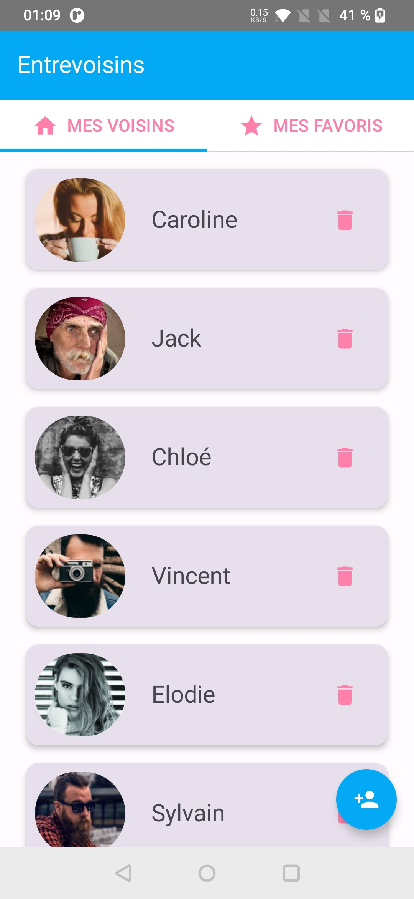
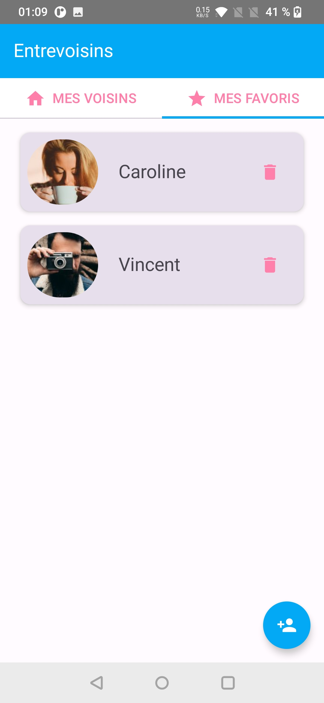
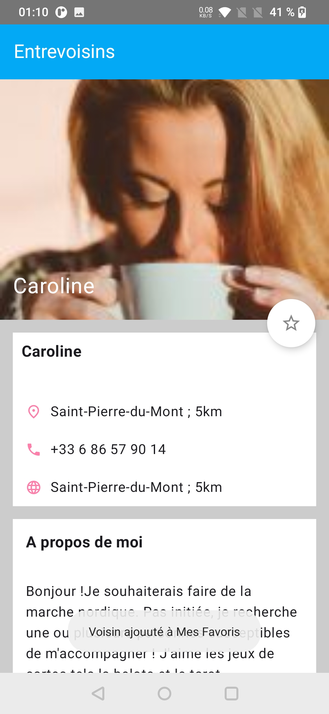
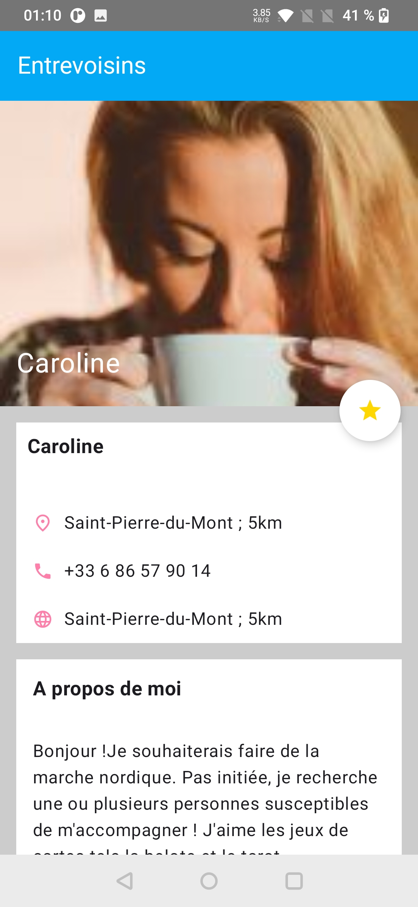
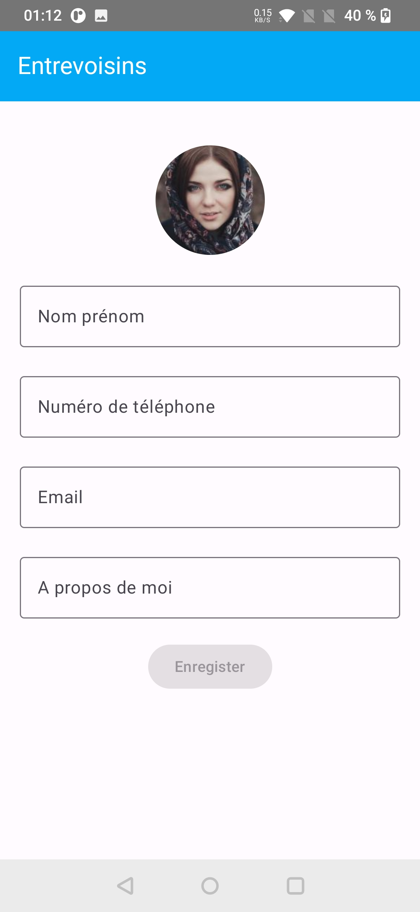

EntreVoisins (Kotlin version

Application développé en Kotlin avec Jetpack Compose, Hilt
# Sujets abordés / démontrés
 * Kotlin
 * Architecture MVVM (Model View ViewModel)
 * `LiveData` 
 * `Coroutine` & `Flow`
 * Jetpack Compose
 * RoomDatabase`Repository` & `Dao Room`
 * Injection de dépendance (DI) avec `Hilt`

